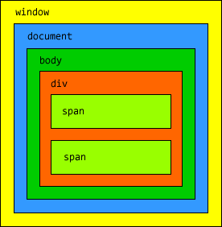

# 21v-js
DOM или объектная модель документа
===================================

Данный html-код:
```
<html>
<head>
    <title>Hello, JavaScript!</title>
</head>
<body>
    <div>
        <span>Раз</span>
        <span>Два</span>
    </div>
</body>
</html>
```
Сформирует следующую структуру DOM:
-----------------------------------

Format: 

во главе всего у нас кореневой объект window, который внутри себя содержит объект document, который в свою очередь содержит объект body, а объект body - все остальные объекты, которые тоже могут содежать другие объекты.
```
<html>
<head>
    <title>Hello, JavaScript!</title>
    <script>
    window.onload = function(){
        alert(window.document.body.innerHTML);
    }
    </script>
</head>
<body>
    <div>
        <span>Раз</span>
        <span>Два</span>
    </div>
</body>
</html>
```
innerHTML - свойство, объекта document, которое используеться если нужно вытащить код из HTML-документа или поменять его.

Следующий фрагмент кода затрёт все содержимое объекта body, а вместо него выведет слово пусто.
```
<html>
<head>
    <title>Hello, JavaScript!</title>
    <script>
    window.onload = function(){
        window.document.body.innerHTML = '(пусто)';
    }
    </script>
</head>
<body>
    <div>
        <span>Раз</span>
        <span>Два</span>
    </div>
</body>
</html>
```
document.body.children
-----------------------
Хотя если мы посмотрим в исходный код, то увидим что старая структура элементов у нас осталась, но зато в инспекторе будет отображаться только надпись пусто.

Чтобы получить доступ к нашему div мы уже не можем использовать конкатынацию строк, но у каждого элемента объектной модели документа есть свойство children - это массив его детей, где мы по индексу можем обращаться к детям. Поскольку div у нас первый и единственный потомок тега body, то можно использовать следующую конструкцию, которая покажет нам внутренний HTML код указанного потомка:
```
<html>
<head>
    <title>Hello, JavaScript!</title>
    <script>
    window.onload = function(){
        alert(window.document.body.children[0].innerHTML);
    }
    </script>
</head>
<body>
    <div>
        <span>Раз</span>
        <span>Два</span>
    </div>
</body>
</html>

document.body.children
-----------------------
```
Такое ображение не очень удобное, поэтому мы можем занести вышеуказнное выражение в переменную и использовать далее именно её:
```
<html>
<head>
    <title>Hello, JavaScript!</title>
    <script>
    window.onload = function(){
        var div = window.document.body.children[0];
        alert(div.innerHTML);
    }
    </script>
</head>
<body>
    <div>
        <span>Раз</span>
        <span>Два</span>
    </div>
</body>
</html>
```
document.body.children
----------------------
Чтобы получить доступ к тегам span нужно использовать уже ранее созданную переменную и обращаться к дочерним элементам этой перенной - к дочерним элементам тега div:
```
<html>
<head>
    <title>Hello, JavaScript!</title>
    <script>
    window.onload = function(){
        var div = window.document.body.children[0];
        var span2 = div.children[1];
        alert(span2.innerHTML);
    }
    </script>
</head>
<body>
    <div>
        <span>Раз</span>
        <span>Два</span>
    </div>
</body>
</html>
```
lenght
-------
С помощью свойства lenght можно узнать длинну массива - тоесть количество элементов в массиве.
```
<html>
<head>
    <title>Hello, JavaScript!</title>
    <script>
    window.onload = function(){
        var div = window.document.body.children[0];
        alert(div.children.length);
    }
    </script>
</head>
<body>
    <div>
        <span>Раз</span>
        <span>Два</span>
    </div>
</body>
</html>
```
innerHTML
---------
Также мы можем устанавливать innerHTML не только для body, но и для любого другого элемента:
```
<html>
<head>
    <title>Hello, JavaScript!</title>
    <script>
    window.onload = function(){
        var div = window.document.body.children[0];
        var span2 = div.children[1];
        span2.innerHTML = '2';
    }
    </script>
</head>
<body>
    <div>
        <span>Раз</span>
        <span>Два</span>
    </div>
</body>
</html>
```
parentNode
----------
parentNode - выведет ссылку на родительский элемент.
```
<html>
<head>
    <title>Hello, JavaScript!</title>
    <script>
    window.onload = function(){
        var div = window.document.body.children[0];
        var span2 = div.children[1];
        alert(span2.parentNode.innerHTML);
    }
    </script>
</head>
<body>
    <div>
        <span>Раз</span>
        <span>Два</span>
    </div>
</body>
</html>
```

У каждого элемента есть свойство innerHTML, которое позволяет получить содержимое элемента в виде HTML кода - его можно как читать так и записывать в него.
У каждого объекта есть массив потомков, мы можем узнать размер этого массива с помощью свойства length и обращаться к каждого элементу данного массива по индексу с помощью свойства children[].
У каждого элемента есть свойство parentNode, которое указывает на родителя.

Свойства объектов JavaScript
=============================
С помощью функции можно увидеть много различных свойств у нашего элемента span2:
```

<html>
<head>
    <title>Hello, JavaScript!</title>
    <script>
    window.onload = function(){           
        var div = document.body.children[0];
        var span2 = div.children[1];
        var_dump(span2);
    }
    
    function var_dump(obj){
        var s = '<h1>' + obj + '</h1>';
        s += '<ol>';

        for (p in obj)
            s += '<li><b>' + p + '</b> : ' + obj[p] + '</li>';
        
        s += '</ol>';
        window.document.body.innerHTML = s;
    }   
    </script>
</head>
<body>
    <div>
        <span>Раз</span>
        <span>Два</span>
    </div>
</body>
</html>
```

[object HTMLSpanElement]
------------------------
```
title :
lang :
translate : true
dir :
dataset : [object DOMStringMap]
hidden : false
tabIndex : -1
accessKey :
draggable : false
spellcheck : true
contentEditable : inherit
isContentEditable : false
offsetParent : [object HTMLBodyElement]
offsetTop : 8
offsetLeft : 34
offsetWidth : 26
offsetHeight : 17
style : [object CSSStyleDeclaration]
innerText : Два
outerText : Два
webkitdropzone :
onabort : null
onblur : null
oncancel : null
oncanplay : null
oncanplaythrough : null
onchange : null
onclick : null
onclose : null
oncontextmenu : null
oncuechange : null
ondblclick : null
ondrag : null
ondragend : null
ondragenter : null
ondragleave : null
ondragover : null
ondragstart : null
ondrop : null
ondurationchange : null
onemptied : null
onended : null
onerror : null
onfocus : null
oninput : null
oninvalid : null
onkeydown : null
onkeypress : null
onkeyup : null
onload : null
onloadeddata : null
onloadedmetadata : null
onloadstart : null
onmousedown : null
onmouseenter : null
onmouseleave : null
onmousemove : null
onmouseout : null
onmouseover : null
onmouseup : null
onmousewheel : null
onpause : null
onplay : null
onplaying : null
onprogress : null
onratechange : null
onreset : null
onresize : null
onscroll : null
onseeked : null
onseeking : null
onselect : null
onshow : null
onstalled : null
onsubmit : null
onsuspend : null
ontimeupdate : null
ontoggle : null
onvolumechange : null
onwaiting : null
click : function click() { [native code] }
focus : function focus() { [native code] }
blur : function blur() { [native code] }
onautocomplete : null
onautocompleteerror : null
namespaceURI : http://www.w3.org/1999/xhtml
prefix : null
localName : span
tagName : SPAN
id :
className :
classList :
attributes : [object NamedNodeMap]
innerHTML : Два
outerHTML : Два
shadowRoot : null
scrollTop : 0
scrollLeft : 0
scrollWidth : 0
scrollHeight : 0
clientTop : 0
clientLeft : 0
clientWidth : 0
clientHeight : 0
onbeforecopy : null
onbeforecut : null
onbeforepaste : null
oncopy : null
oncut : null
onpaste : null
onsearch : null
onselectstart : null
onwheel : null
onwebkitfullscreenchange : null
onwebkitfullscreenerror : null
previousElementSibling : [object HTMLSpanElement]
nextElementSibling : null
children : [object HTMLCollection]
firstElementChild : null
lastElementChild : null
childElementCount : 0
hasAttributes : function hasAttributes() { [native code] }
getAttribute : function getAttribute() { [native code] }
getAttributeNS : function getAttributeNS() { [native code] }
setAttribute : function setAttribute() { [native code] }
setAttributeNS : function setAttributeNS() { [native code] }
removeAttribute : function removeAttribute() { [native code] }
removeAttributeNS : function removeAttributeNS() { [native code] }
hasAttribute : function hasAttribute() { [native code] }
hasAttributeNS : function hasAttributeNS() { [native code] }
getAttributeNode : function getAttributeNode() { [native code] }
getAttributeNodeNS : function getAttributeNodeNS() { [native code] }
setAttributeNode : function setAttributeNode() { [native code] }
setAttributeNodeNS : function setAttributeNodeNS() { [native code] }
removeAttributeNode : function removeAttributeNode() { [native code] }
closest : function closest() { [native code] }
matches : function matches() { [native code] }
getElementsByTagName : function getElementsByTagName() { [native code] }
getElementsByTagNameNS : function getElementsByTagNameNS() { [native code] }
getElementsByClassName : function getElementsByClassName() { [native code] }
insertAdjacentHTML : function insertAdjacentHTML() { [native code] }
createShadowRoot : function createShadowRoot() { [native code] }
getDestinationInsertionPoints : function getDestinationInsertionPoints() { [native code] }
requestPointerLock : function requestPointerLock() { [native code] }
getClientRects : function getClientRects() { [native code] }
getBoundingClientRect : function getBoundingClientRect() { [native code] }
scrollIntoView : function scrollIntoView() { [native code] }
insertAdjacentElement : function insertAdjacentElement() { [native code] }
insertAdjacentText : function insertAdjacentText() { [native code] }
scrollIntoViewIfNeeded : function scrollIntoViewIfNeeded() { [native code] }
webkitMatchesSelector : function webkitMatchesSelector() { [native code] }
animate : function animate() { [native code] }
remove : function remove() { [native code] }
webkitRequestFullScreen : function webkitRequestFullScreen() { [native code] }
webkitRequestFullscreen : function webkitRequestFullscreen() { [native code] }
querySelector : function querySelector() { [native code] }
querySelectorAll : function querySelectorAll() { [native code] }
nodeType : 1
nodeName : SPAN
baseURI : file:///home/janus/github/21v-js/unit_03/dom/2.html
ownerDocument : [object HTMLDocument]
parentNode : [object HTMLDivElement]
parentElement : [object HTMLDivElement]
childNodes : [object NodeList]
firstChild : [object Text]
lastChild : [object Text]
previousSibling : [object Text]
nextSibling : [object Text]
nodeValue : null
textContent : Два
hasChildNodes : function hasChildNodes() { [native code] }
normalize : function normalize() { [native code] }
cloneNode : function cloneNode() { [native code] }
isEqualNode : function isEqualNode() { [native code] }
compareDocumentPosition : function compareDocumentPosition() { [native code] }
contains : function contains() { [native code] }
lookupPrefix : function lookupPrefix() { [native code] }
lookupNamespaceURI : function lookupNamespaceURI() { [native code] }
isDefaultNamespace : function isDefaultNamespace() { [native code] }
insertBefore : function insertBefore() { [native code] }
appendChild : function appendChild() { [native code] }
replaceChild : function replaceChild() { [native code] }
removeChild : function removeChild() { [native code] }
isSameNode : function isSameNode() { [native code] }
ELEMENT_NODE : 1
ATTRIBUTE_NODE : 2
TEXT_NODE : 3
CDATA_SECTION_NODE : 4
ENTITY_REFERENCE_NODE : 5
ENTITY_NODE : 6
PROCESSING_INSTRUCTION_NODE : 7
COMMENT_NODE : 8
DOCUMENT_NODE : 9
DOCUMENT_TYPE_NODE : 10
DOCUMENT_FRAGMENT_NODE : 11
NOTATION_NODE : 12
DOCUMENT_POSITION_DISCONNECTED : 1
DOCUMENT_POSITION_PRECEDING : 2
DOCUMENT_POSITION_FOLLOWING : 4
DOCUMENT_POSITION_CONTAINS : 8
DOCUMENT_POSITION_CONTAINED_BY : 16
DOCUMENT_POSITION_IMPLEMENTATION_SPECIFIC : 32
addEventListener : function addEventListener() { [native code] }
removeEventListener : function removeEventListener() { [native code] }
dispatchEvent : function dispatchEvent() { [native code] }
```
Мы можем добавлять новые свойства любым (даже встроенным) объектам:
-------------------------------------------------------------------
```
<html>
<head>
    <title>Hello, JavaScript!</title>
    <script>
    window.onload = function(){           
        var div = document.body.children[0];
        var span2 = div.children[1];

        span2.myProperty = 1000;

        var_dump(span2);
    }
    
    function var_dump(obj){
        var s = '<h1>' + obj + '</h1>';
        s += '<ol>';

        for (p in obj)
            s += '<li><b>' + p + '</b> : ' + obj[p] + '</li>';
        
        s += '</ol>';
        window.document.body.innerHTML = s;
    }   
    </script>
</head>
<body>
    <div>
        <span>Раз</span>
        <span title='Title for span2' lang='English'>Два</span>
    </div>
</body>
</html>
```

[object HTMLSpanElement]
-------------------------
```
myProperty : 1000
title : Title for span2
lang : English

```
Функция getElementById 
=======================
позволяет быстро получать доступ к элементам - принимает строкое значение идентификатора и возвращает DOM-объект, а если такого элемента не найдено, то возвращает NULL.

Для того чтобы изменить стилевое свойство элемента нужно воспользоваться фукнцией style:

```
<html>
<head>
    <title>Hello, JavaScript!</title>
    <script>
    window.onload = function(){           
        var span1 = document.getElementById('one');
        span1.style.color = 'red';
        span1.style.fontWeight = 'bold';
    }  
    </script>
</head>
<body>
    <div>
        <span id="one">Раз</span>
        <span>Два</span>
    </div>
</body>
</html>
```

CSS свойства
-------------
CSS свойства, название которых указываються через дефис (дефис на самом деле в JavaScript означает операцию вичитания) нужно удалять, а второе слово указывать с большого регистра.

Вышеуказанным способом можно снова проверить сколько есть возможных CSS свойст для контретного элемента:
```
<html>
<head>
    <title>Hello, JavaScript!</title>
    <script>
    window.onload = function(){           
        var span1 = document.getElementById('one');

        var_dump(span1.style);  
    }

    function var_dump(obj){
        var s = '<h1>' + obj + '</h1>';
        s += '<ol>';

        for (p in obj)
            s += '<li><b>' + p + '</b> : ' + obj[p] + '</li>';
        
        s += '</ol>';
        window.document.body.innerHTML = s;
    }   
    </script>
</head>
<body>
    <div>
        <span id="one">Раз</span>
        <span>Два</span>
    </div>
</body>
</html>
```
